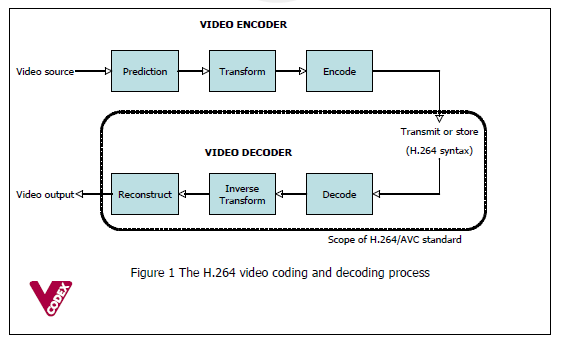

## AWS lambda
### czym jest?
    AWS Lambda is a microservice framework designed to
    execute user-supplied Lambda functions in response to
    asynchronous events, e.g., message arrivals, file uploads,
    or API calls made via HTTP requests. Upon receiving an
    event, AWS Lambda spawns a worker, which executes
    in a Linux container with configurable resources up to
    two, 2.8 GHz virtual CPUs, 1,536 MiB RAM, and about
    500 MB of disk space. AWS Lambda provisions additional
    containers as necessary in response to demand.
### ograniczenia
    1. Lambda functions must be installed before being
    invoked, and the time to install a function is much
    longer than the time to invoke it.
    2. The timing of worker invocations is unpredictable:
    workers executing warm (recently invoked) functions
    spawn more quickly than those running cold
    functions (§ 2.4). In addition, workers may spawn
    out of order.
    3. Amazon imposes a limit on the number of workers a
    user may execute concurrently.
    4. Workers are behind a Network Address Translator
    (NAT). They can initiate connections, but cannot
    accept them, and so they must use NAT-traversal
    techniques to communicate with one another.
    5. Workers are limited to five minutes’ execution time.

### jak je obejść?
  - koordynator zarządzający przydzielaniem i zbieraniem wyników tasków przez RPC
  
        First, mu uses a long-lived coordinator that provides
        command and control for a fleet of ephemeral workers
        that contain no thread-specific logic. Instead, the coordinator
        steps workers through their tasks by issuing RPC requests
        and processing the responses. For computations in
        which workers consume outputs from other workers, mu’s
        coordinator uses dependency-aware scheduling: the coordinator
        first assigns tasks whose outputs are consumed,
        then assigns tasks that consume those outputs. This helps
        to avoid deadlock and reduce end-to-end completion time.
  - jedna, generyczna lambda
  
        Second, all workers in mu use the same generic
        Lambda function. This Lambda function is capable of
        executing the work of any thread in the computation.
        As described above, at run time the coordinator steps
        it through its assigned task. This means the user only installs
        one Lambda function and thus that workers spawn
        quickly because the function remains warm.
  - serwer pośredniczący
  
        Third, we use a rendezvous server that helps each worker communicate
        with other workers. The end result is a highly parallel,
        distributed, low-latency computational substrate.

### (nie dające się obejść)
  - ograniczona liczba tasków per AWS region
  
        This design does not completely sidestep the above limitations.
        Amazon was willing to increase our concurrent
        worker limit only to 1,200 per AWS region (the default is
        100). We still need to partition our largest computations
        among several regions.
  - max 5 minut / task
  
        In addition, the five-minute worker
        timeout seems unavoidable. For ExCamera this limitation
        does not cause serious problems since the system aims
        for smaller end-to-end latencies, but it prevented us from
        benchmarking certain alternative systems (§ 5).

## mu framework
### elementy
  - workers
  
        mu workers are short-lived Lambda function
        invocations. When a worker is invoked, it immediately
        establishes a connection to the coordinator, which thereafter
        controls the worker via a simple RPC interface. As
        examples, the coordinator can instruct the worker to retrieve
        from or upload to AWS S3; establish connections
        to other workers via a rendezvous server; send data to
        workers over such connections; or run an executable.
  - coordinator
  
        The coordinator is a long-lived server (e.g.,
        an EC2 VM) that launches jobs and controls their execution.
        To launch jobs, the coordinator generates events,
        one per worker, using AWS Lambda API calls via
        HTTP (§ 2.1). These HTTP requests are a bottleneck
        when launching thousands of workers, so the coordinator
        uses many parallel TCP connections to the HTTP server
        (one per worker) and submits all events in parallel.
  - rendezvous
  
        Like the coordinator, the rendezvous server
        is long lived. mu’s rendezvous is a simple relay server
        that stores messages from workers and forwards them to
        their destination.

### API
      Developing computations with mu.
      To design a computation,
      a user specifies each worker’s sequence of RPC requests
      and responses in the form of a finite-state machine
      (FSM), which the coordinator executes. mu provides a
      toolbox of reusable FSM components as a Python library

## kodowanie video
- czym jest key frame?

      To allow this, video encoders insert Stream Access
      Points in the compressed bitstream—one at the beginning,
      and additional ones in the middle. A Stream Access Point
      resets the stream and serves as a dependency barrier: the
      decoder can begin decoding the bitstream at a Stream
      Access Point, without needing access to earlier portions
      of the bitstream. The same concept5 goes by different
      names in different video formats: a “closed Group of Pictures”
      (MPEG-2 [17]), an “Instantaneous Display Refresh”
      (H.264 [11]), or a “key frame” (VP8/VP9 [26, 29]). We
      use the term “key frame” in this paper.
- jak kodowane są pozostałe ramki?

  
  - prediction modes
  - motion vectors
  - residue
  
        The goal of an interframe is to be as short as possible,
        by exploiting correlations between the intended output
        image and the contents of the three reference slots in the
        decoder’s state. It does that by telling the decoder how to
        assemble a “prediction” for the output image. Every 4x4-
        pixel square is tagged with a prediction mode describing
        where to find visually similar material: either one of the
        three references, or elsewhere in the current frame.
        For prediction modes that point to one of the three
        references, the 4x4-pixel square is also tagged with a
        motion vector: a two-dimensional vector, at quarter-pixel
        precision, that points to a square of the reference image
        that will serve as the prediction for this square.
        When decoding an interframe, the decoder uses the
        prediction modes and motion vectors to assemble the
        motion-compensated prediction image. It then adds the
        residue—an overlay image that corrects the prediction—
        applies a smoothing filter, and the result is the output
        image. The interframe also tells the decoder how to update
        the probability model, and which reference slots in the
        state object should be replaced with the new output image
- jakie znaczenie ma odstęp pomiędzy key frame'ami?

      But key frames incur a significant cost. As an example,
      a raw frame of 4K video is about 11 megabytes. After
      compression in the VP8 format at 15 Mbps, a key frame
      is typically about one megabyte long. If the video content
      stays on the same scene without a cut, subsequent frames—
      those allowed to depend on earlier frames—will be about
      10–30 kilobytes. Spurious insertion of key frames signifi-
      cantly increases the compressed bitrate.

## ExCamera encoder
### algorytm
    1. (Parallel) Each thread runs a production video encoder
    (vpxenc) to encode six compressed frames,
    starting with a large key frame.
    2. (Parallel) Each thread runs our own video encoder
    to replace the initial key frame with one that takes
    advantage of the similarities with earlier frames.
    3. (Serial) Each thread “rebases” its chunk of the video
    onto the prior thread’s output, so that the chunks can
    be played in sequence by an unaltered VP8 decoder
    without requiring a key frame in between.

  - enkodowanie kilku-ramkowych chunków
  
        1. (Parallel) Each thread downloads an N-image chunk
        of raw video. At the resolution of a 4K widescreen
        movie, each image is 11 megabytes.
        2. (Parallel) Each thread runs Google’s vpxenc VP8
        encoder. The output is N compressed frames: one
        key frame (typically about one megabyte) followed
        by N − 1 interframes (about 10–30 kilobytes apiece).
  - usuwanie key frame'ów
  
        3. (Parallel) Each thread runs ExCamera’s decode operator
        N times to calculate the final state, then sends
        that state to the next thread in the batch.
        4. (Parallel) The first thread is now finished and uploads
        its output, starting with a key frame. The
        other N − 1 threads run encode-given-state to encode
        the first image as an interframe, given the state
        received from the previous thread. The key frame
        from vpxenc is thrown away; encode-given-state
        works de novo from the original raw image.
  - rebase
  
        5. (Serial) The first remaining thread runs rebase to
        rewrite interframes 2..N in terms of the state left behind
        by its new first frame. It sends its final state to
        the next thread, which runs rebase to rewrite all its
        frames in terms of the given state. Each thread continues
        in turn. After a thread completes, it uploads
        its transformed output and quits.

### dodatkowe operacje
  - encode-given-state
  
        This routine takes a state (including the three reference
        images), and a raw input image, and searches for the best
        combination of motion vectors and prediction modes so
        that the resulting interframe approximates the original
        image to a given fidelity.
  - rebase
  
        While encode-given-state creates a compressed frame
        de novo, a rebase is a transformation on compressed
        frames, taking advantage of calculations already done.
        Rebasing involves three steps:
        1. Don’t redo the slow part. Rebasing adopts verbatim
        the prediction modes and motion vectors from
        the original interframe.
        2. Apply motion prediction to new state. Rebasing
        applies those prediction modes and motion vectors
        to the new state object, producing a new motioncompensated
        prediction image.
        3. Recalculate residue given original target image.
        Rebasing subtracts the motion-compensated prediction
        image from the original input to the encoder:
        the raw target image that was taken “ex camera,”
        i.e., directly from the camera. This “fast” subtraction
        produces a new residue, which is encoded into the
        output interframe′.
